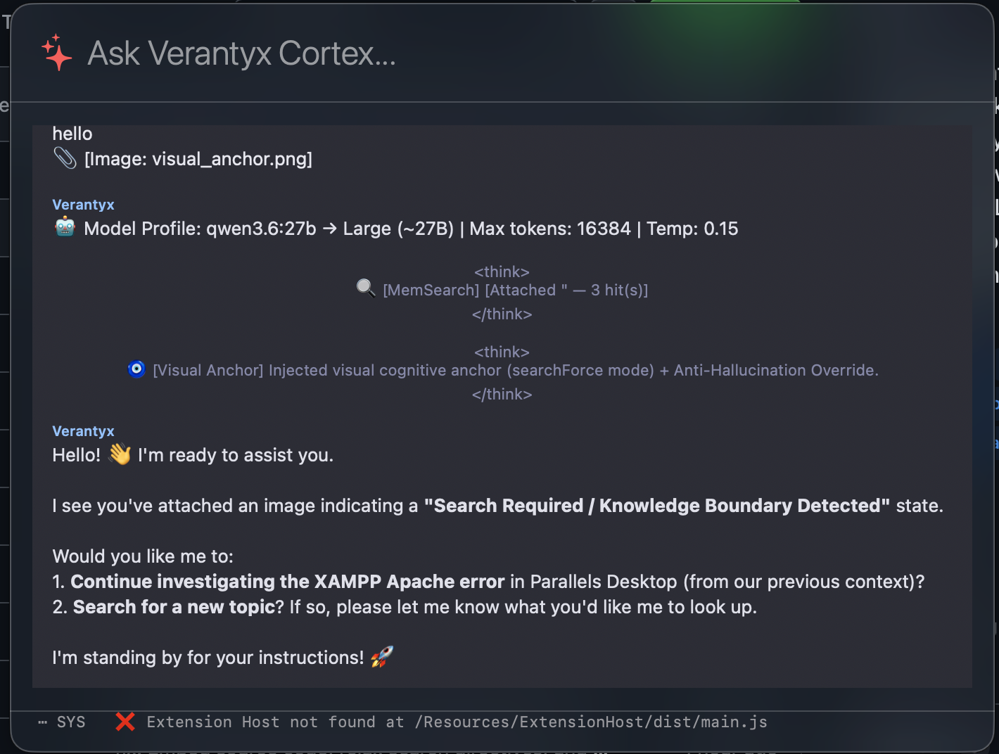

  <h1>🛡️ Verantyx IDE & Cortex Engine</h1>
  
<b>The Zero-Leakage, Neuro-Symbolic AI Coding Gateway & Native macOS IDE</b>

    
    
    
    
  

  

    <a href="README-en.md">English</a> · <a href="README-es.md">Español</a> · <a href="README-pt-BR.md">Português (Brasil)</a> · <a href="README-de.md">Deutsch</a> href="README-fr.md">Français</a> · <a href="README-zh-CN.md">简体中文</a> · <a href="README-zh-TW.md">번체중문</a> · <a href="README-ko.md">한국 href="README.md">한국어</a> · <a href="README-ar.md">العربية</a> · <a href="README-ru.md">Русский</a> · <a href="README-uk.md">Українська</a> · <a href="REA
  

---

## 📖 Verantyx 정보

이 프로젝트는 이전에 룰 베이스의 심볼릭 AI를 작성하려고 했을 때에 개인에서는 만드는 것은 불가능하다고 생각해, 현재 주류의 AI의 하네스의 부분 등 제어하는 ​​부분을 자작하는 것으로 제어하려고 생각했습니다. (당시는 openclaw가 주목을 받고 있었던 시기)
거기서 이 프로젝트의 주목적인 클라우드의 고성능 AI에 전달하기 전에 소스 코드나 사용자의 요청을 난독화하여 퍼즐과 같은 상태로 전달함으로써 정보 유출을 막는 것이 아닐까 생각해 개발을 시작했습니다.

이 프로젝트가 스타 0인 이유에 대해, 이 프로젝트에 보안 폴더가 포함되어 있었기 때문에 갑자기 개인 리포지토리로 했기 때문에, 9 있던 스타가 소멸했습니다. 완전히 부활했으므로 잘 부탁드립니다. 다른 리포지토리와 중복을 일으키는 부분을 정리했습니다. 이 리포지토리에서 릴리스를 중심으로 푸시하고 있었지만 소스 코드 업데이트가 멈추었던 것을 발견하고 업데이트했습니다.

앞으로는 모국어인 일본어를 주력으로 하고, 영어는 통상의 번역 툴에 번역시켜 일단 적재한다고 하는 운용으로 가자고 생각하고 있습니다.

## 🔐 난독화와 6축(Axis)의 입체 십자 구조체

이 프로젝트의 난독화에 있어서, 사고방식은 이전 데이터의 전달 방법의 이미지로서 초기에 만든 verantyx의 전신인 axis등에서 발견한 입체 십자 구조체를 주로 한 데이터 관리 수법을 채용하고 있습니다.

### 🧩 6차원(Axis) 정의

| 축 | 이름 | 역할 / 추출되는 요소 |
| :--- | :--- | :--- |
**X축** | **Control Flow(제어 흐름)** | 시간 및 순서 축. `if` 분기, `for` 루프, 예외 처리 등. |
|**Y축** |**Data Flow(데이터 흐름)** | 종속성 축. 변수의 대입, 인수의 전달 등. |
**Z축** | **Type Constraints(형 제약)** | 경계 축. 클래스 정의, 타입 어노테이션, 제네릭스 등. |
**W축** | **Memory Lifecycle(메모리 수명 주기)** | 수명 축. 스코프의 생존 기간, 메모리의 확보·해방. |
**V축** | **Scope Hierarchy(스코프 계층 구조)** | 포함된 축. 모듈, 클래스 중첩 구조. |
**U축** | **Semantics & Meaning(의미·의도)** | **★가장 중요한 ★ 업무의 의도의 축. 특정 변수 이름, 함수 이름, 원시 문자열, 숫자. ** |

이 변환 프로세스는 Verantyx의 **Gatekeeper(게이트 키퍼) 엔진**에 의해 로컬 환경의 MacBook에서 즉시 실행됩니다.

---

### 🔄 원시 코드를 Opaque Topology로 변환하는 메커니즘

#### Step 1: AST(추상 구문 트리)로의 퍼스와 분해
먼저 Gatekeeper 엔진(규칙 기반 권장)이 대상 소스 코드를 구문 분석하고 프로그램의 구조를 **AST(Abstract Syntax Tree)**라는 트리 구조의 데이터로 변환합니다.
이 시점에서는, 아직 「어떤 함수가 무엇을 호출하고 있는가」 「변수명은 무엇으로, 캐릭터 라인으로서 무엇이 정의되고 있는지」라고 하는 정보가 모두 포함되어 있습니다.

#### Step 2: 시멘틱스(U축)의 「물리적 박리와 격리」
여기서부터는 Verantyx의 진골정입니다. AST 중에서 **업무의 의미(의도)를 나타내는 정보=U축**을 모두 물리적으로 벗겨냅니다.

* **벗겨지는 것(U축)**: 변수명, 함수명, 캐릭터 라인, 고정의 수치등.
* ** 남아있는 것 (X, Y, Z, W, V 축) ** : "변수를 대입했다" "함수를 호출했다" "if 문으로 분기했다" "for 문으로 루프했다"라는 논리적인 골조.

벗겨진 구체적인 이름이나 문자열의 데이터는, 당신의 Mac의 로컬에 있는 **`JCrossIRVault`(금고)**에 엄중하게 보관되어 결코 외부에는 송신되지 않습니다.

#### Step 3: Opaque Node(불투명 노드)에 대한 완전 암호화
의미를 벗겨낸 나머지 "골조"를 클라우드 LLM에 보내기 위해 완전히 불투명한 표현으로 변환합니다.

* **`NODE[0x...]` (노드 ID)**: 모든 변수와 구문 요소는 임의의 메모리 주소와 같은 식별자로 대체됩니다.
* **`ARITY`(알리티/항수)**:
    * `class.nullary`: 인수나 내용이 없는 요소(단순한 값이나 종단 노드).
    * `class.standard`: 표준 단항 · 이항 연산 (A + B 나 대입 등).
    * `class.multiway`: 여러 요소를 가진 복잡한 구조 (for 루프, if-else 분기, 함수 정의 등).
* **`HASH`(구조 해시)**: 그 노드가 그래프의 어느 위치에 있어, 주위와 어떻게 연결되어 있는지를 나타내는 체크섬. 이렇게 하면 LLM이 퍼즐을 풀고 반환할 때 구조가 손상되지 않았는지 로컬로 확인할 수 있습니다.

원래 코드의 문장조차 소멸하고, 「`class.multiway` 의 노드가 자식 노드를 반복 처리하고 있다」라고 하는 순수한 수학적 그래프가 됩니다.

#### Step 4: 통계적 추측을 막는 '디코이'
코드를 그래프 구조로 하여 외부로 보냈을 경우, 고도의 AI나 악의가 있는 공격자가 「이 그래프의 형태는, 자주 있는 스크립트의 형태다」라고 통계적으로 추측(리버스 엔지니어링) 해 오는 리스크가 있습니다.

이를 방지하기 위해 그래프 틈에 **가짜 노드(디코이)**를 무작위로 주입합니다.
``text
// _TOKEN_유:0.2___jcross_BM_505__ [decoy-metadata]
``
이 무의미한 한자의 토큰과 더미의 연결을 섞어 그래프의 형태 자체를 왜곡시켜 외부 AI가 원래 소스 코드의 정체를 추측하는 것을 수학적으로 불가능하게 하고 있습니다.

---

### 🧩 LLM은 어떻게 이것을 "수정"하는가? (복원 프로세스)

1. **퍼즐로 풀기**:
   LLM은 원래 코드를 몰라도 지시된 컨텍스트와 그래프 형태(ARITY와 HASH의 연결)에서 대상이 되는 변경점의 값이어야 한다고 추론합니다.
2. **구조 패치 반송**:
   LLM은 내용을 다시 작성하는 JSON 형식의 구조 패치(GraphPatch)만 반환합니다.
3. **로컬 재결합(Reverse Transpilation)**:
   Mac의 Gatekeeper 엔진이 패치를 받고 이전에 `JCrossIRVault`에 숨겨 놓은 진짜 변수 이름과 문자열 (U 축)을 패치에 Gachan과 다시 주입합니다.

결과적으로 **"외부 AI는 원래 코드를 한 줄도 보고 있지도 이해도 하지 않지만 로컬로 돌아오면 올바르게 코드가 다시 쓰여져 있다"**라는 마법처럼 정보 유출이 없다는 개발 체험이 성립합니다. ※ 아직 내가 간과하고 있는 정보의 유출이 있을지도 모르기 때문에 눈치채면 issue등으로 알려 주세요.

---

## ⚠️ 현재 대응할 수 없는 (약한) 태스크

현재 이 구조에서 대응할 수 없는 태스크에 대해서, 대표적인 제일 서투른 태스크는 **Swift에서 Rust 언어로의 재기록** 등의 태스크에는 대응할 수 없습니다. 또 아래와 같은 1부터 4까지가 서투른 태스크입니다.

### 1. 의미(도메인 지식)에 의존하는 리팩토링 및 버그 수정
외부의 LLM에는 `NODE[0x...]` 라고 하는 골조 밖에 보이지 않기 때문에, **「코드의 의미를 이해하지 않으면 풀 수 없는 문제」** 에는 대처할 수 없습니다.
* **❌ 서투른 지시의 예**: "인증(Authentication)에 관련된 변수의 이름에 모두 `auth_` 라는 접두사를 붙여"
* ** 이유 ** : LLM에는 "어떤 인증 처리"가 전혀 보이지 않습니다.

### 2. 외부 라이브러리(API)에 강하게 의존하는 새로운 기능 추가
소스 코드내의 `import` 문이나 라이브러리 호출도 모두 `NODE` 로서 암호화되고 있기 때문에, 특정의 라이브러리의 지식이 필요한 태스크가 곤란하게 됩니다.
* **❌ 서투른 지침의 예**: "AWS S3에 파일을 업로드하는 기능 추가"
* ** 이유 ** : LLM은 현재 코드가 어떤 외부 라이브러리를 사용하는지 알지 못합니다.

### 3. "0부터 완전히 새로운 기능 전체"를 작성하는 것
Gatekeeper는 “기존의 구조(AST)를 패치·수정한다”는 것은 매우 강력합니다만, “아무것도 없는 백지의 상태로부터, 의미(U축)와 구조의 양쪽 모두를 가지는 거대한 신기능을 만들어낸다”는 서투른입니다.

### 4. LLM 자체의 "사전 학습 지식"의 무력화에 의한 추론 저하
Gemma와 Claude와 같은 LLM은 전세계 소스 코드를 배우고 현명해졌지만 Verantyx가 보내는 형식은 ** "이 세상의 어떤 언어도 아닌 순수한 기호와 해시 그래프"**입니다.
* ** 이유 ** : LLM이 자랑하는 "코드의 맥락에서 패턴 인식"을 봉인하고 있기 때문에, 본 적이없는 난해한 수학의 그래프 퍼즐이되어 버려, 계산 비용의 증대를 일으키고 있습니다.

### 💡 어떻게 극복하고 있습니까? (향후 전망)
현재, 이러한 약점을 극복하기 위해 Verantyx 측에서 구현되고 있는 것이 **「Tri-Layer JCross Memory(3층 메모리)」**와 **「Visual Anchors(시각적 앵커)」**의 조합입니다. 기밀 정보가 없는 안전한 메타데이터만을 시각적 앵커로 LLM에 부분적으로 제시하고 보안을 유지하면서 힌트를 주는 접근법을 취하고 있습니다.

---

## 📽️ 데모 동영상 및 코드 변환의 실제

  
  <video src="https://github.com/verantyx/verantyx/releases/download/v1.2.5/demo_skill_generation.mov" controls="controls" muted="muted" width="49%" style="border-radius: 8px;"></video>

### Before & After: 난독화의 실제

**[Before] Raw Source Code (Local Environment)**
``파이썬
import json
import os
import shutil
import requests
import subprocess
import re
from tqdm import tqdm
import sys

# Import our new parser
sys.path.append(os.path.join(os.path.dirname(__file__), "src"))
from verantyx.cross_engine.jcross_extraction_parser import JCrossExtractionParser

ORACLE_FILE = "/Users/motonishikoudai/verantyx-cli/benchmarks/LongMemEval/data/longmemeval_m_cleaned.json"
TARGET_DIR = "/Users/motonishikoudai/verantyx-cli/verantyx-browser/.ronin/jcross_v7"
QUERY_BIN = "/Users/motonishikoudai/verantyx-cli/verantyx-browser/target/release/examples/query_jcross"
MODEL = "gemma4:e2b"
OLLAMA_URL = "http://localhost:11434/api/generate"

FINAL_REPORT = "/Users/motonishikoudai/verantyx-cli/benchmarks/LongMemEval/official_v7_1_accuracy_report.json"
``

**[After] Gatekeeper JCross Opaque Topology (Sent to Cloud LLM)**
``lisp
;;; 🛡️ GATEKEEPER MODE — JCross IR View
;;; Real identifiers have been replaced with node IDs.
;;; Schema: D59144D1-BE1
;;; Nodes: 124 | Secrets redacted: 3442
;;; Source: cortex/bench_v7_1_puzzle_runner.py
;;;
// JCROSS_6AXIS_BEGIN
// lang:swift doc:0xD5E025

// ── TOP-LEVEL NODES
  NODE[0x7995] kind:opaque TYPE:opaque MEM:opaque HASH:0xb4af0a52 ARITY:class.multiway
  NODE[0x9DB8] kind:opaque TYPE:opaque MEM:opaque HASH:0x504933fd ARITY:class.standard
  NODE[0x627F] kind:opaque TYPE:opaque MEM:opaque HASH:0x97b540cb ARITY:class.multiway
  NODE[0x7F4C] kind:opaque TYPE:opaque MEM:opaque HASH:0x86742e8c ARITY:class.standard
  NODE[0xC79E] kind:opaque TYPE:opaque MEM:opaque HASH:0xd42206c4 ARITY:class.standard
  NODE[0x510B] kind:opaque TYPE:opaque MEM:opaque HASH:0x14b9be4e ARITY:class.nullary
  NODE[0xB5C0] kind:opaque TYPE:opaque MEM:opaque HASH:0xcacb18a2 ARITY:class.standard
// _TOKEN_유:0.2___jcross_BM_505__ [decoy-metadata]
  NODE[0xE3CF] kind:opaque TYPE:opaque MEM:opaque HASH:0x375a5480
``

---

## 💻 설치 방법(소스에서 빌드)

** 필수 요구 사항 : **
- macOS 14.0 이상 (Apple Silicon 권장)
- Xcode 15.0 이상

``bash
git clone https://github.com/Ag3497120/Verantyx.git
cd Verantyx/cli/VerantyxIDE
open Verantyx.xcodeproj
# Verantyx 체계를 선택하고 Cmd + R을 눌러 빌드하고 실행합니다.
``

*주의: Windows/Linux로의 이식(Rust 코어 + llama.cpp)은 장기적인 로드맵에 있지만, 현재는 네이티브 macOS/MLX 아키텍처의 완성에 극도로 주력하고 있습니다. *

---

## 🔧 리포지토리 설정 및 기록 정보

**Git 설정에 대한 알림:**
이 리포지토리의 초기 커밋은 개발자의 macOS 사용자 이름에서 파생 된 `kofdai`라는 로컬 Git 이름으로 이루어졌습니다. 2026년 5월 24일로 이 문제는 수정되었으며 현재 모든 커밋이 올바르게 `@Ag3497120`에 귀속되도록 설정되어 있습니다. 이것은 개발 환경을 설정하는 일반적인 문제이며 봇이나 자동화 도구로 인한 것이 아닙니다. 미래의 모든 기여는 올바른 저자 이름으로 기록됩니다.

---

## 💡 Q&A와 어필 (Experimental Features)

현재 `Control` 키를 세 번 눌러 **Verantyx Agent**를 시작할 수 있습니다.

  

이 모드는 이전 응용 프로그램에 있던 다양한 IDE 모드의 실험장으로 만들어졌습니다. 프로젝트 전체를 검토하고 실제로 요구되는 '게이트 키퍼 모드'에 집중하기 위해 지금까지 만든 에이전트 동작의 실험적인 기능군을 이 **Verantyx Agent**에 집약했습니다.

이전 릴리스에 포함된 에이전트의 주요 기능은 다음과 같습니다.

* **Dual Twin 감사 시스템**: AI가 툴을 호출하여 게으른 문제를 방지하기 위해 내부에서 JCross를 주입하고 TwinA의 툴 호출의 타당성을 TwinB가 감사하는 구조를 도입했습니다.
* **Visual Anchor의 도입**: 스킬이나 지시를 프롬프트만으로 제어하고 있던 것을 Visual Anchor에 의한 화상 주입과 프롬프트의 하이브리드 방식으로 변경했습니다.
* **L3.5 OS Asset Map의 구축**: Control×3로 기동하는 에이전트에 있어서, 「L3.5」라고 하는 PC 내부의 맵을 로컬만으로 보관 유지. 에이전트에 대해 PC내의 자산이 자신의 지능과 연결되어 있다는 의식을 심었습니다.
* **AX API를 이용한 고정밀 GUI 조작**: 기존의 스크린 레코딩에 의한 GUI 조작에서, OS의 API 트리(액세서빌러티 API)를 이용한 확실하고 고정밀 조작에 이행했습니다.
* **한자 토폴로지 압축**: L3.5 맵을 컨텍스트에 주입할 때, 이미지를 생성해 프롬프트로서 이용하는 것으로 컨텍스트의 비대화를 방지. 「한자 토폴로지」라고 하는 독자적인 압축 형식과 실 데이터를 대응시켜, 적절히 필요한 데이터만이 주입되도록(듯이) 했습니다.
* **에이전트 모드의 확장**: 「자동 모드」와 「상세 모드」의 2 종류를 추가했습니다.
* **내부 지식 우선 모드**: 제한 해제 모델 등을 사용하는 파워 유저용으로, 로컬 AI를 단순한 오케스트레이터로서가 아니라, 메인의 사고 모델·지식원으로서 풀 활용하기 위한 모드를 실장했습니다.
* **L3.5 전용의 기억 라인 정비**: L3.5 맵의 기억이 복잡하고 다량이 되는 것을 막기 위해, 통상의 대화 기억과는 완전히 다른 기억 라인을 정비했습니다.
* **파인 튜닝에의 응용**: L1에서 L3.5까지의 기억으로부터 유저의 아이덴티티가 되는 데이터를 추출해, 임의의 모델에 대해 파인 튜닝을 실시할 수 있는 발판이 되는 기능을 구현했습니다(기억 시스템 단체에서는 불가능한 최적화를 실현).
* **FAR 존 구조의 채용**: 「기억을 삭제하지 않고 정리한다」라는 이념에 근거해, 태스크 완료시에 태스크의 패키지나 타이틀등의 천이 프로세스를 기록해, 「FAR 존」이라고 불리는 새로운 계층에 떨어뜨리는 구조를 채용했습니다. 이렇게하면 작업이 끝난 후에도 작업 프로세스와 같은 중요한 기억이 유지됩니다.

이들은 현재 추가된 기능의 매우 일부입니다.
최근 업데이트에서는 HuggingFace에 게시한 `talkie-1930:13b`의 부분 양자화 버전을 사용한 오케스트레이션(Blind Commander Architecture)을 도입했습니다. 「1930년의 지식밖에 갖지 않는다」라고 하는 제한을 역수로 취해, 커멘드의 실행에는 룰 베이스의 중개자를 사이에 두고, 유저의 메세지를 당시의 비유 표현에 고치는 역할을 갖게 하고 있습니다. 이 "실험적이다"라는 프로젝트의 이념을 구현하는 기능의 추가가 이루어지고 있습니다.

### 🔄 미래의 로드맵과 대형 시련

이 에이전트와 게이트키퍼 모드는 현재 같은 기억 영역에서 연결되어 있습니다만, 장래적으로는 이것을 분리·세세한 조정을 할 수 있도록 하는 기능을 구현 예정입니다.

현재 이 에이전트 개발은 임시 도달 지점에 도달했습니다. 나 자신이 학생이라고 하는 것도 있어, Teams등에서 내놓은 과제("최근에 나온〇〇의 과제에 대해서 작성해 제출해"라고 하는 태스크)를 이 에이전트가 완전하게 해낼 수 있게 된 효력에는, 현재 개선안을 반영하고 있는 「게이트키퍼 모드」의 본격적인 개발에 착수하고 싶다고 생각하고 있습니다. 스타를 붙여 주신 여러분, 감사합니다. 잠시만 기다려주세요.

마지막으로 이 프로젝트의 집대성으로 준비하고 있는 특대의 시련에 대해 이야기하겠습니다.

1. **Windows판에의 이식(Rust 베이스)**: 현재 macOS용으로 Swift 언어로 쓰여지고 있는 구현을 Rust 베이스에 재작성해, 같은 게이트키퍼 기능을 Windows 유저 여러분에게도 체험해 주시기 위한 태스크입니다.
2. **클라우드 의존으로부터의 완전 탈퇴**: 고액의 API 요금을 지불하지 않고, 로컬의 LLM만으로 자율적으로 개발을 계속할 수 있는 에이전트로 성장시키는 것입니다. MacBook에서 움직이는 20B 클래스의 모델(최근 `qwen3.6:27b` 등, 특정 조건 하에서 최고봉 모델에 필적한다고 하는 것)을 활용해, 클라우드 레벨에 가까운 코딩 에이전트를 가동시켜, 자율적으로 개선을 거듭해 프로젝트를 진행해 나가고 싶습니다.