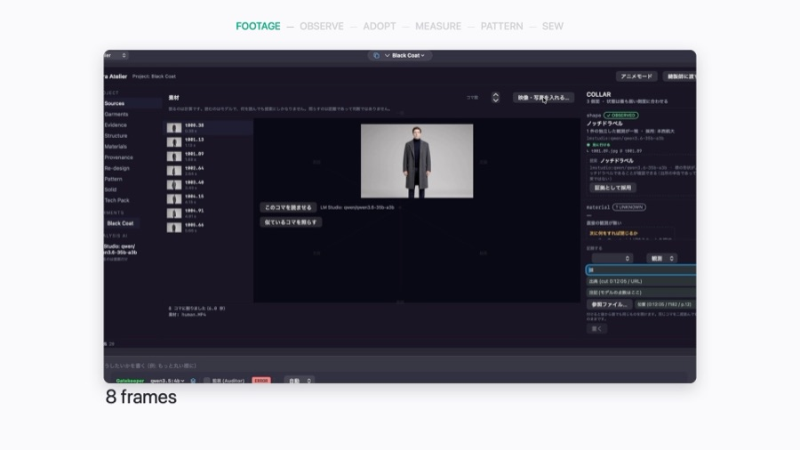
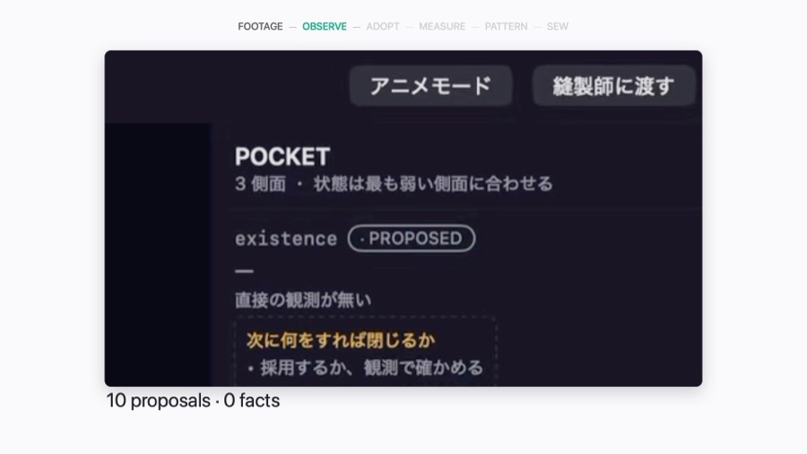
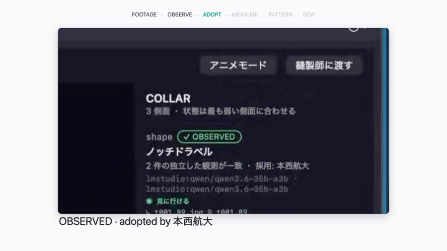
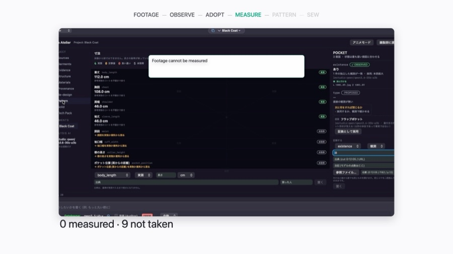
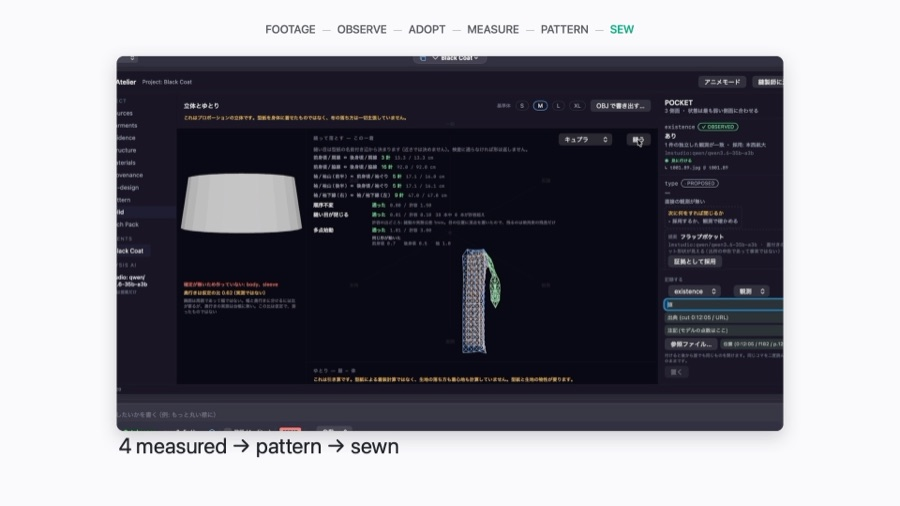
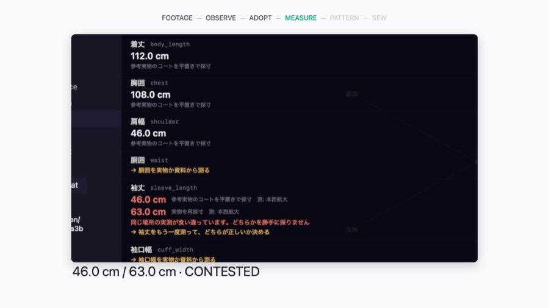
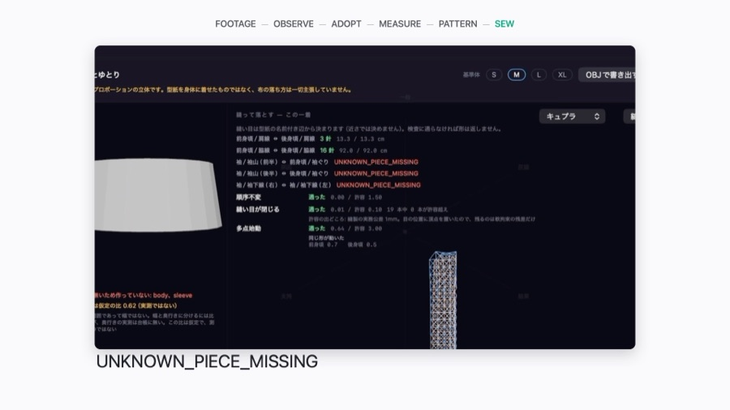
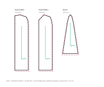

<h1 align="center">photoloset</h1>

<p align="center">
  
</p>

<p align="center">
  <b>From a coat on screen to a sewable 1:1 pattern — every number carries the name of whoever measured it, and anything nobody measured is refused out loud.</b>
</p>

<p align="center">
  <a href="LICENSE"></a>
  
  
  
  <a href="https://github.com/Ag3497120/photoloset/actions/workflows/ci.yml"></a>
</p>

---

Most garment AI tools answer every question. This one is built the other way
round: it will tell you the pattern it can draft, and it will tell you, by
name, what it was never given. A guess that reaches a cutting table costs
fabric, so nothing that was not measured is allowed to look like something
that was.

The pipeline below is the whole tool. Each step can refuse, and a refusal
says what would close it.

<br>

<table>
<tr>
<td width="55%"></td>
<td width="45%" valign="top">
<h3>1 &nbsp;·&nbsp; Footage</h3>
<p><b>What happens.</b> A clip goes in. Frames are cut at fixed timestamps and
stored. From here on, every claim about this garment has to point back at one
of them.</p>
<p><b>Under the hood.</b> Frames are held as <code>Source</code> and
<code>Clip</code> records carrying the file, the byte count and the mark in
the clip. A claim that cannot name a frame has nowhere to live.</p>
</td>
</tr>
</table>

<p align="center"><sub>│</sub><br><sub>▼</sub></p>

<table>
<tr>
<td width="55%"></td>
<td width="45%" valign="top">
<h3>2 &nbsp;·&nbsp; Observe</h3>
<p><b>What happens.</b> A vision model reads one frame and proposes ten things.
The tool writes down ten proposals and zero facts.</p>
<p><b>Under the hood.</b> Model output lands as <code>PROPOSED</code> entries
tagged with the model id and the frame. The drafting step reads only
<code>OBSERVED</code>, so a proposal cannot reach a pattern no matter how
confident it is.</p>
</td>
</tr>
</table>

<p align="center"><sub>│</sub><br><sub>▼</sub></p>

<table>
<tr>
<td width="55%"></td>
<td width="45%" valign="top">
<h3>3 &nbsp;·&nbsp; Adopt</h3>
<p><b>What happens.</b> A proposal becomes a fact only when a person adopts it,
by name.</p>
<p><b>Under the hood.</b> <code>Entry.adopted_by</code> is required for
<code>kind="observed"</code>; anonymous adoption is refused at the ledger.
Two independent readings of different frames agreeing is corroboration, not
proof — both frames stay openable, and you can go look.</p>
</td>
</tr>
</table>

<p align="center"><sub>│</sub><br><sub>▼</sub></p>

<table>
<tr>
<td width="55%"></td>
<td width="45%" valign="top">
<h3>4 &nbsp;·&nbsp; Measure</h3>
<p><b>What happens.</b> Footage cannot be measured. The numbers come off a
tape, on a real garment, typed in by a person.</p>
<p><b>Under the hood.</b> A <code>Measure</code> carries value, unit, basis,
source and <code>by</code>. Units are converted through an explicit table; an
unrecognised unit drops to <i>missing</i> rather than being assumed to be
centimetres. Assuming 1.0 is the quietest way to be wrong.</p>
</td>
</tr>
</table>

<p align="center"><sub>│</sub><br><sub>▼</sub></p>

<table>
<tr>
<td width="55%"></td>
<td width="45%" valign="top">
<h3>5 &nbsp;·&nbsp; Draft &amp; sew</h3>
<p><b>What happens.</b> Four measured numbers become three pieces. The pieces
get notches, seam allowance and a grain line, then they are sewn and the cloth
is allowed to fall.</p>
<p><b>Under the hood.</b> Seventeen drafting formulas are printed in the
output — no shape constant is left hidden in the source. The cloth is a
mass-spring mesh minimised by gradient descent with a <b>Jacobi</b> update, so
the answer does not depend on the order vertices are visited: that is true by
construction, and the tool labels the order check <code>structural</code>
rather than reporting it as a test that passed.</p>
</td>
</tr>
</table>

<p align="center"><sub>│</sub><br><sub>▼</sub></p>

<table>
<tr>
<td width="55%"></td>
<td width="45%" valign="top">
<h3>6 &nbsp;·&nbsp; Refuse</h3>
<p><b>What happens.</b> Forty-six centimetres, or sixty-three. It can draft a
sleeve from either. It will not draft one from two, and it does not quietly
pick the first.</p>
<p><b>Under the hood.</b> Two readings of the same spot differing by more than
0.5&nbsp;cm become <code>CONTESTED_MEASUREMENT</code>, and the refusal carries a
<code>how_to_close</code> field. The same discipline covers shape: a sleeve
sewn into a tube can rotate about its axis, so multiple starts disagree, and
the refusal names the piece rather than returning one of the answers.</p>
</td>
</tr>
</table>

<p align="center"><sub>│</sub><br><sub>▼</sub></p>

<table>
<tr>
<td width="55%"></td>
<td width="45%" valign="top">
<h3>7 &nbsp;·&nbsp; Ledger</h3>
<p><b>What happens.</b> Every claim about the garment sits on one page with its
state, and the page ends with the thing that was never observed.</p>
<p><b>Under the hood.</b> Five states — <code>OBSERVED</code>,
<code>CONTESTED</code>, <code>INFERRED</code>, <code>PROPOSED</code>,
<code>UNKNOWN_NOT_OBSERVED</code>. An <code>UNKNOWN_*</code> is a first-class
result, not an error: it is the tool reporting the shape of its own ignorance.</p>
</td>
</tr>
</table>

<br>

## The pattern it produces

<p align="center">
  
</p>

Drawn at 1:1 in centimetres, on four layers: cut line, notch, grain and sewing
line. Seam allowance is not a stored number — it is the offset between the cut
line and the sewing line, so the two can never disagree. Notches are drawn at
their real 2.5&nbsp;mm, which means they are almost invisible on screen and
correct on paper.

> Layer numbers are an internal naming convention. ASTM D6673-10 was withdrawn
> in January 2019 with no replacement, so this tool does not claim conformance
> to it.

<br>

## What it does, and what it does not

| It does | It does not |
| --- | --- |
| Draft three pieces (front bodice, back bodice, sleeve) from four measurements | Handle any other garment — the block is hard-coded |
| Print all 17 drafting formulas so you can argue with them | Implement a published system (Bunka, Dorémé, …) |
| Place notches, seam allowance and grain lines | Darts, pleats, gathers, facings, linings |
| Detect two measurements of the same spot disagreeing | Decide which of them is right |
| Sew the pieces and drape them under gravity | Model bending, collision or friction — wrinkles here are mesh artefacts, not cloth |
| Convert cm / mm / inch, and refuse unknown units | Guess a unit that was not given |
| Name the piece it cannot determine | Return a shape it cannot justify |
| Export SVG at 1:1 | Export DXF/AAMA, markers, BOMs, or graded size runs |
| Serve the whole engine over MCP, and run as a macOS app | Any of it on Windows or Linux — the app is macOS only; the engine is not |
| Record who adopted each fact | Correct a fact once adopted — there is no amendment path yet |

**Measured limits worth knowing before you trust a number:**

- The default stitch stiffness (16× the cloth) **does not close this garment**.
  Measured on the three-piece coat: worst stitch 0.91&nbsp;cm open, 15 of 41
  stitches past the 1&nbsp;mm tolerance. At 64× it closes at 0.06&nbsp;cm with 0
  over tolerance. The example passes `stitch_k` explicitly rather than accepting
  a seam the tool itself reports as open. The residual is printed on every run.
- The drape is a **generated shape**. It is not evidence and cannot be cited as
  an observation. The tool says so in its own output, not only here.
- English output is a **translation layer over the engine**, not a rewrite of
  it, because the drafting code is shared with a larger project and two copies
  would drift. A string the table does not know comes back in Japanese — and
  `i18n.missing(result)` lists exactly which, so the gap is visible rather than
  papered over. Measured across every output path the engine has (ledger,
  worklist, tech pack, measurements, draft, marks, sew, drape, all five
  refusals and the SVG): **0 untranslated**.

<br>

## Install and run

No dependencies. Python 3.9 or newer.

```bash
git clone https://github.com/Ag3497120/photoloset.git
cd photoloset
python3 -m photoloset --lang en
```

That is the application: a local page on `127.0.0.1:8910`, stdlib only, no
build step and no framework. It shows the ledger as a garment — colour is
state, clicking a part opens the structure inspector on the right, proposals
carry an adopt button that demands a name, and the tech pack prints. Nothing
leaves the machine unless you pass `--lan`, which opens it to your own network
and says so when it starts.

<p align="center">
  
</p>

### The macOS app in the film

The frames throughout this README come from **`app/`**, which is in this
repository. It is a macOS agent IDE, it opens on this workbench, and it is
what the demo shows.

```bash
open app/Verantyx.xcodeproj      # ⌘R, or:
cd app && xcodebuild -scheme Verantyx -configuration Debug build
```

Building the workbench on an agent IDE rather than as a purpose-built garment
app is deliberate. It arrives carrying the parts a garment tool would otherwise
have to grow itself: model clients for the vision step, an MCP host, a file
tree, a console. What this package adds is the half that has to be exact.

**It runs on this package's engine.** The app used to embed a 78 MB frozen
helper for the same 42 tools; it now launches `python3 -m photoloset.mcp`
instead, found in its own bundle Resources, where a build phase copies the
250 KB Python package. So the two halves are one program, and the tool surface
is the seam between them.

Three things did not come across, and it is worth knowing why:

| | |
| --- | --- |
| the 78 MB `vera-memory` binary | replaced by `photoloset.mcp` |
| a 75 MB backup of it | a stale copy of the same thing |
| `verantyx-browser/` | a separate Rust project — and the source of four paths with colons in their names, which cannot be checked out on Windows at all |

Five of the 42 tools answer `UNKNOWN_NOT_IN_THIS_BUILD` rather than working:
`garment_cross` and the four `fabric_*` tools need a coordinate memory and its
language engine, about 15,700 lines that are not part of this package. Fabric
properties are read from `~/.photoloset/fabrics.json` instead.

To see the whole pipeline run end to end, with no app at all:

```bash
python3 examples/black_coat.py
```

Or drive it from any agent, which is what the app does:

```bash
python3 -m photoloset.mcp        # 42 tools over stdio, standard library only
```

## Thirty seconds of it

```python
import photoloset
photoloset.set_language("en")     # or leave it and get the engine's Japanese

from photoloset import Measure, Measures
from photoloset import garment_marks, garment_pattern, garment_sew

ms = Measures()
for spot, value in [("body_length", 112.0), ("chest", 108.0),
                    ("shoulder", 46.0), ("sleeve_length", 63.0)]:
    ms.entries.append(Measure(
        spot=spot, kind="measured", value=value, unit="cm",
        basis="reference coat, laid flat",
        source="tape measure", by="your name here"))

draft = garment_pattern.draft(ms)      # verdict ANSWER, 3 pieces, 7306.1 cm2
marks = garment_marks.apply(draft)     # 16 notches, 8 paired, 3 grain lines
open("coat.svg", "w").write(garment_pattern.to_svg(marks))
```

Add a second, conflicting reading of the same spot and the tool stops:

```python
ms.entries.append(Measure(spot="sleeve_length", kind="measured", value=46.0,
                          unit="cm", basis="the real coat, measured again",
                          source="tape measure", by="your name here"))

ms.state("sleeve_length")
# {'state': 'CONTESTED_MEASUREMENT',
#  'sides': [{'value': 63.0, ...}, {'value': 46.0, ...}],
#  'tolerance_cm': 0.5,
#  'how_to_close': 'measure the sleeve again and decide which one is right'}
```

**Full walkthrough: [docs/USAGE.md](docs/USAGE.md).**

### Language

```python
import photoloset
photoloset.set_language("en")        # every entry point returns English
photoloset.i18n.missing(result)      # what it could not translate — should be []
photoloset.i18n.coverage(result)     # (translated, total)
```

`photoloset.en(value)` translates a single value without changing the default,
and `i18n.svg(document)` translates a pattern SVG — labels and notes only, with
the notes re-wrapped for English line lengths and the canvas grown to fit.
Every coordinate is left exactly as the engine emitted it.

<br>

## How it is checked

```bash
python3 tests/run_checks.py
```

The same thing CI runs, on every push and pull request, across Python 3.9 and
3.12 on Linux and macOS, plus a macOS build of the app. Each check prints what
it measured rather than just PASS, because a check that only says PASS tells
you nothing on the day it starts lying.

It re-measures the numbers quoted in this file, so the document cannot drift
away from the code in silence — and it asserts that the default stitch
stiffness still **fails** to close the garment. If that ever starts passing,
this README is the thing that is wrong.

Behaviour is pre-registered: the falsifying condition is written down before
the check is run, so a check that cannot fail is caught as a check that cannot
fail rather than counted as a pass. Three examples of what that discipline
found, each of which had been reported as working:

- A seam-closed check that judged by the **mean**, reporting `closed=true`
  while one stitch of 23 stood 3.66&nbsp;cm open. It now judges by the worst
  stitch and prints the count over tolerance beside it.
- Units read from the input and then **ignored** — a pattern entered in inches
  drafted as centimetres, 6027&nbsp;cm² silently becoming 511&nbsp;cm².
- Three seam checks that **could not fail**, because they compared a point list
  to itself. They now detect the tautology by comparing the point lists, and
  say `structural` in the output instead of claiming a verification.

<br>

## Where this actually stands

This is one working pipeline, not a product. The four things below are the
ones most likely to matter to you, and none of them is close to solved.

Each is open as an issue with the experiment that would settle it, because
these are questions rather than tasks — if you have a garment, a tape and some
footage, you can answer one of them without touching the code:

| | |
| --- | --- |
| [#1](https://github.com/Ag3497120/photoloset/issues/1) | Does the observe step fail loudly or quietly on cinematic footage? |
| [#2](https://github.com/Ag3497120/photoloset/issues/2) | Why does the seam gap widen with more iterations, and is 16x the right default? |
| [#3](https://github.com/Ag3497120/photoloset/issues/3) | Second clip — does any of this generalise? |
| [#4](https://github.com/Ag3497120/photoloset/issues/4) | The sleeve is non-unique. Is refusing right, or is there a principled pick? |

**One garment, and only one.** The drafting block is a single hard-coded
three-piece body — front bodice, back bodice, sleeve. There is no notion of a
garment *type*. A jacket with darts and a canvas front, a shirt with a yoke and
a collar stand, trousers, a skirt, anything knitted, anything cut on the bias:
none of these exist here, and adding one is not a parameter change, it is a new
block with new formulas and new seams. Treat the coat as a worked example of the
discipline, not as coverage.

**Numbers do not come out of the footage.** This is the caveat to read twice.
The footage is used to *identify* things — this collar, that pocket — and a
person then measures a real reference garment with a tape and types the numbers
in. The tool refuses to derive a dimension from a frame, on purpose, because a
frame has no scale in it. So "film to pattern" is honest about identification
and dishonest if you read it as "film to measurements". If you do not have the
physical garment, or something close enough to measure, this tool cannot draft
for you.

**It has been run end to end on exactly one clip** ([#3](https://github.com/Ag3497120/photoloset/issues/3)). That clip happened to suit
it: the coat is presented plainly, the light is even, the framing is stable, and
a reference garment was on hand. There is no second clip, no held-out set, and
therefore no evidence about how any of this behaves on footage it has not seen.
Every number in this README comes from that one run.

**Cinematic footage is untested, and it is the intended target** ([#1](https://github.com/Ag3497120/photoloset/issues/1)). A film frame
is graded, key-lit, shadowed, often motion-blurred and often grainy. All of
those change what a vision model reads out of a frame, and none of them has been
measured here. The honest position is that we do not know whether the observe
step degrades *loudly* — proposing less, so the ledger simply stays emptier —
or *quietly*, proposing confident nonsense that a person then adopts. Those two
failure modes are not equally bad, and which one happens is exactly the
experiment that has not been run. Until it has, treat any proposal drawn from
stylised footage as untrustworthy in a way the tool cannot currently flag for
you.

**Computation is not solved either** ([#2](https://github.com/Ag3497120/photoloset/issues/2), [#4](https://github.com/Ag3497120/photoloset/issues/4)). The solver is pure Python, roughly
O(iterations x edges): about 4 seconds for 2000 iterations over 303 points and
954 edges. It stops because it hits the iteration cap, not because it converged
— and running it longer can make the worst seam gap *worse*, not better,
because gravity is winning against the stitch springs (measured on this coat:
2.23 cm at 2000 iterations, 5.50 cm at 8000, 7.22 cm at 20000). There is no
bending energy, no self-collision and no friction, so the fall of the cloth is a
plausible-looking artefact of a spring mesh rather than a simulation of fabric.
A sleeve sewn into a tube is genuinely non-unique — it can rotate about its own
axis — and multiple starts disagree by 11.4 cm, which is why the tool names the
piece and declines instead of returning one of them.

## Licence

MIT — see [LICENSE](LICENSE).

The drafting block is this tool's own simplification, not a published system,
and the pattern is derived from measurements rather than traced from anyone's
pattern. If you feed it a garment you do not own the rights to, that is between
you and them; the ledger records where you said each thing came from, which is
the point.
