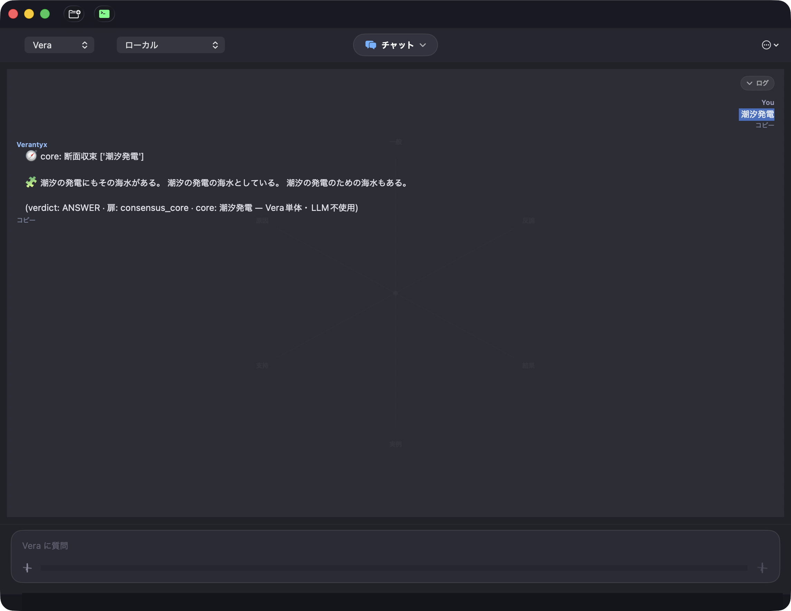
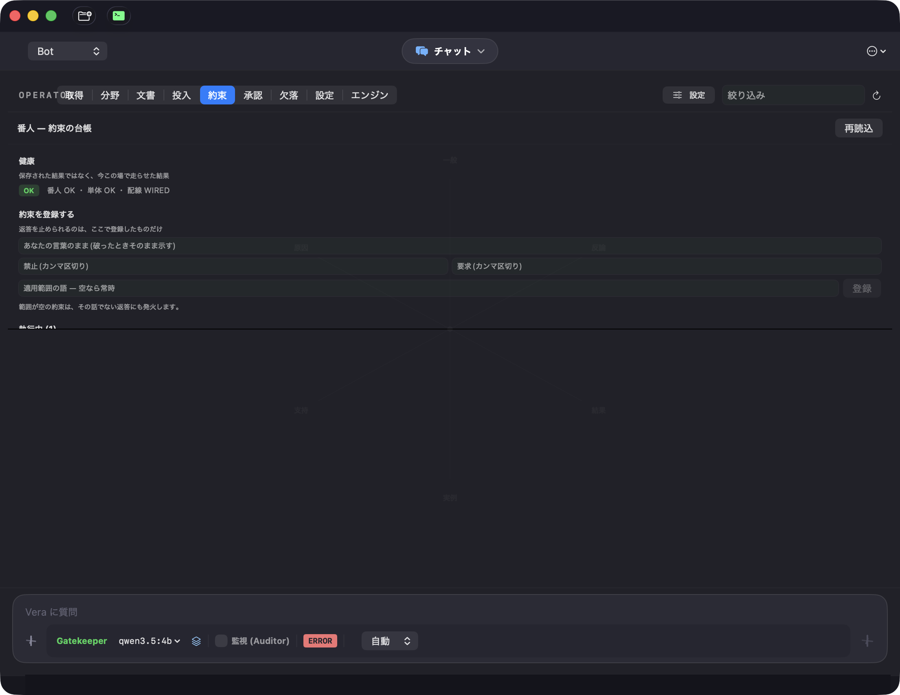
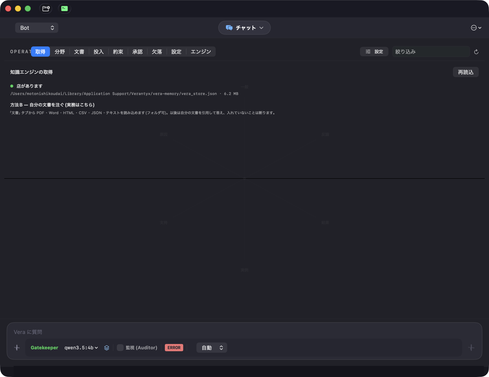

<div align="center">

# 🛡️ Verantyx

**An engine that answers only from what it holds — and says so, in a type, when it does not.**

No embeddings. No sampling. No network. The same question returns the same answer,
and the order you loaded the documents in cannot change it.



*One question, one typed verdict, the door it came through, and the core it answered from — `LLM不使用`.*

</div>

---

## The one-line version

Every other part of this repository is optional. **This is the part that is different:**

| | Vera-a | An LLM (or an embedding RAG) |
|---|---|---|
| Asked something it never read | **`UNKNOWN_NO_EVIDENCE`, with a reason** | returns the nearest paragraph, fluently |
| Asked twice | identical answer, always | varies |
| Documents loaded in another order | identical answer (6-permutation check) | n/a |
| Where the answer came from | the core, the door, the source | not recoverable |
| Its own drift from your instructions | named by number (`kept_before → kept_recently`) | cannot see it |
| Cost | 0.04 s, offline, on a laptop | a call |



*The covenant guard: what you settled, checked against every reply. `番人 OK・単体 OK・配線 WIRED` is re-run **on your machine at the moment you look**, not a stored badge.*

---

## 立体十字 — what the structure is, and what it was measured to do

Vera's store is not a vector index. Each **core** sits at the centre of a stereo
cross: **6 arms × 4 faces**, arms paired into three dualities —
支持/反論 (supports / opposes), 原因/結果 (cause / effect),
一般/実例 (general / instance). A question enters from an edge, the faces
converge, and the words along the surviving path *are* the answer.

Everything below is a measurement from this project's own logs, not a design claim.

### 1. A node holds exactly 24 words, and that forces the layers

`6 arms × 4 faces = 24`. Words that do not land on a face are **unreachable**,
and no amount of adding helps:

| words per arm | path selection correct |
|---|---|
| 4 (= the faces) | 20/24 |
| 8 | 3/8 |
| 16 | 1/8 |
| 32 | 0/8 |
| 60 | 0/8 |

So depth ≈ **log₆(V/4)**. Nesting (マトリョーシカ) is not a design preference —
it is what the geometry demands once vocabulary grows.

### 2. Placement cannot add information — so it can detect fabrication

If moving the same facts to different faces changes the answer, the answer came
from the arrangement, not the evidence. Perturbing **only the tie-breaks** and
keeping what survives:

| method | fabrication rate |
|---|---|
| frequency rule alone | 30.9% |
| + placement pre-simulation | 13.2% |
| + re-check under a changed placement | **7.4%** |
| frequency rule + re-check | **0.0%** |

The price is honest and stated: legitimate answers fall from 3 to 1 in that
last column. It is a precision dial, and it is set conservatively.

### 3. Ties abstain, because a deterministic tie-break invents agreement

| tie handling | all-layer agreement | accuracy |
|---|---|---|
| insertion order | 86 cases | 73.3% |
| dictionary order | 321 cases | 23.7% |
| **abstain** | 77 cases | **100%** |

A deterministic system does not have to answer. Returning `UNKNOWN`
deterministically is the safer property.

### 4. The same knowledge, seen at several resolutions, grades its own confidence

Hold one corpus at several grain sizes (1 char / 2 chars / word) and several
knowledge amounts, then ask all of them the same question:

| how many layers agreed | accuracy |
|---|---|
| 3–4 layers, unanimous | **100%** (77 cases) |
| 2 layers | 31.1% |
| single best layer alone | 29.8% |
| no layer had grounds | — (383 of 600: it says so) |

Two axes (grain × knowledge) give 16 rungs and a usable middle band (88.6%).
**Do not mix the axes**: agreement across *different data* is evidence,
agreement across *different cuts of the same data* is structure — pooled, they
let 8 out-of-corpus answers through where the unpooled version let 0.

### 5. Layer, never pool

Measured six times each way: **pooling two signals into one vote made things
worse 6/6; layering one as input to the next improved things 5/5.**

| pooled | result | layered | result |
|---|---|---|---|
| two languages in one store | wrong answers in both | vocabulary → synthesis | real-word rate 73% → **100%** |
| cut-variants into one census | 0 → 8 out-of-corpus reached | ladder → inference core | 0 → **185/200** answered |

### 6. A refusal says what would close it

Not a dead end — a work queue with a type:

```
UNKNOWN_NOT_PRESENT     → register 3 sentences  → ANSWER (1.4 s over 54,244 cores)
UNKNOWN_SUBJECT_TOO_THIN → 1 fact is not enough → 4 facts → ANSWER
UNKNOWN_NO_CITATION      → supply 1 document    → ANSWER
UNKNOWN_LANGUAGE_NOT_HELD → build that language's sovereign → ANSWER
UNKNOWN_TIME_DEPENDENT   → needs_registration: false  ← registering will NOT fix this
UNKNOWN_NO_SUBJECT       → needs_registration: false
```

The last two matter as much as the first four: the system says when *not* to
feed it, so a queue never fills with items that can never close.

---

## Try it in five minutes



Install the app, open **取得**, and it answers three things in order: is there a
store here, what is published, and how to pour your own. **Nothing downloads
implicitly** — 209 MB moves because you pressed a button.

Or from a terminal:

```bash
git clone https://github.com/Ag3497120/Verantyx.git && cd Verantyx/engine
python3.11 -m verantyx.cli fetch-store            # published store, or:
python3.11 -m verantyx.cli --store ~/s.json documents ~/your-docs/
python3.11 -m verantyx.cli --store ~/s.json ask "交際費"
```

Everything published — three stores and twelve ingestion corpora — lives here:
**[huggingface.co/datasets/kofdai/Verantyx-Vera-base-store](https://huggingface.co/datasets/kofdai/Verantyx-Vera-base-store)**

Prove the claims on your own machine, in 45 seconds:

```bash
python3.11 -m verantyx.cli doctor                    # 8 guarantees, re-run here and now
python3.11 engine/experiments/guard/verify_all.py    # forks 89/89 · measurements 50/50
```

---

## Where Vera beats an LLM, where it is still incomplete, and where it loses badly

Contributors deserve this straight. All three lists are measured.

### ✅ Genuinely ahead (an LLM cannot do these by construction)

- **Typed refusal.** Absence returns `UNKNOWN_*` with a reason. Neighbour search
  always returns something; generation always mixes in outside words.
- **Determinism and order-invariance.** Same input → same verdict, always.
- **Provenance.** Every answer names its core, its door and its source.
- **Drift detection.** `kept_before → kept_recently` names the promise you are
  no longer keeping — the failure an LLM structurally cannot notice about itself.
- **Cost.** 0.04 s per check, offline, no account.

### 🟡 Ahead in principle, still incomplete in practice

- **The prohibition nobody wrote.** Registering "use TypeScript" catches
  `javascript` **without listing it** — but only where the corpus put the two
  side by side. Measured recovery on technical pairs: **1 of 6**; on statutes,
  which do list alternatives: 11 of 14.
- **Contradiction detection.** 858 junctions typed, 189 flagged as contradiction
  *candidates* (22%) — candidates, not findings: it does not yet check the two
  sources were talking about the same occasion.
- **Confidence grading.** The 100% band is real but costs coverage: 383 of 600
  questions got no grounds at all.
- **Required-side promises.** "Always run the tests" is enforced by witnessing a
  real tool execution — but only when the required thing is a program name.
  Japanese generic nouns (「テスト」) cannot be witnessed. [#56](https://github.com/Ag3497120/Verantyx/issues/56)

### ❌ Losing badly to an LLM — and measured to be unfixable by more rules

- **Reading instructions.** Of 20 realistic instructions, 3 were read correctly,
  13 produced nothing, 4 picked the wrong term. Anything a rule reads therefore
  lands in quarantine and **can never block** a reply.
- **Writing prose.** Vera returns the words it holds. Of 184 answers with a
  path, 51 (28%) became sentences; the rest stopped because the centre "is not a
  word". It does not invent sentences, by design and by limitation.
- **Generalising meaning.** TODO → FIXME is not caught unless the corpus wrote
  the pair down.
- **Polarity.** Forbid vs require from vocabulary alone: **54.8%** — a coin flip.
- **Framing a novel task.** An LLM invents a procedure for an unseen problem.
  Vera handles the shapes it was given.

Three separate attempts to widen the rules all failed, measured:
645/661 negations fell outside a 39-word vocabulary; **no frequency threshold
separates content words from function words** (`pytest` 0.1709% sits *above*
`is` 0.1641%, and `eslint` 0.0274% *equals* `are` 0.0274%); and pouring
4.9 M characters of technical prose changed the reading of instructions by
exactly nothing (8/20 byte-identical before and after).

**This is why the architecture is what it is.** The model reads; Vera enforces,
records, and refuses. Neither half is asked to do the other's job.

---

## Repository map

```
engine/   Vera-a — the deterministic engine (Python), including the MCP server
  verantyx/            the package; mcp_server.py is the ONLY interface the IDE uses
  experiments/         75 pre-registrations, 37 result documents, all re-runnable
  tools/guard/         Claude Code hooks
ide/      the macOS app (Swift). Talks to the engine over MCP only.
docs/     ARCHITECTURE.md — a table of "what you want to change → what to edit"
attic/    old debug scripts, kept rather than deleted
```

**The seam is MCP.** 132 named doors. Change a screen → touch only `ide/`.
Change a verdict → touch only `engine/verantyx/`. Nothing in between.

## Contributing

Run this before writing any code — it is why the project stopped building the
same thing twice:

```bash
python3.11 -m verantyx.cli index search "<what you are about to build>"
```

Then read [`engine/CLAUDE.md`](engine/CLAUDE.md) (short) for the lines a change
must not cross: pre-register before measuring, ties abstain, absence is not
denial, nothing is deleted — only archived.

Issues are scoped so that **"done" means a measurement passes**, not that the
code looks right. Good first ones:
[#59 glossary](https://github.com/Ag3497120/Verantyx/issues/59) ·
[#55 character classes](https://github.com/Ag3497120/Verantyx/issues/55) ·
[#57 onedir freeze](https://github.com/Ag3497120/Verantyx/issues/57) ·
[#60 a contrast corpus](https://github.com/Ag3497120/Verantyx/issues/60)

---

## 🧸 The rest of the app is a toy shelf — including the parts that look serious

The IDE ships five modes. **One of them is the product; treat the others as toys**,
because that is what the measurements say they are.

| mode | what it is | honest status |
|---|---|---|
| **Bot** | the OPERATOR console — documents, domains, covenants, gaps, the store | **the real one.** Everything above lives here |
| Vera | 3D stereo-cross chat over the store | a beautiful demo. It answers, and it can also sit spinning for a minute waiting on a local model — **toy** |
| Vera-a / jgen 合議 | multi-model council over local LLMs | **toy.** The council's single-token consensus is known to break on reasoning models, unfixed and documented in the code |
| LLM | a plain chat with a local or cloud model | **toy.** Everyone has one of these |
| Gatekeeper (setting) | local small models rewrite code into an intermediate form so a cloud model never sees proprietary semantics | works; **strong competitors exist.** Do not judge this project here |
| JGEN (setting) | quantized GGUF inference on Metal/NEON, two-Mac layer split over Thunderbolt | works; **strong competitors exist.** Same |

The reason for saying so plainly: a reader who benchmarks the toys concludes the
project is mediocre. A reader who tests the typed refusal and the covenant
ledger sees the one thing here that nobody else offers. **Judge it there.**

## Licence

[LICENSE](LICENSE)
