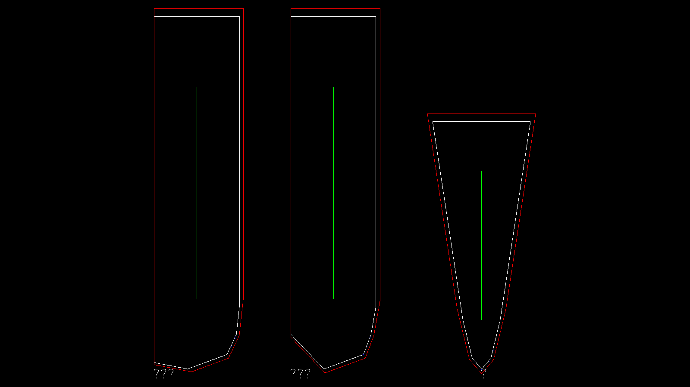
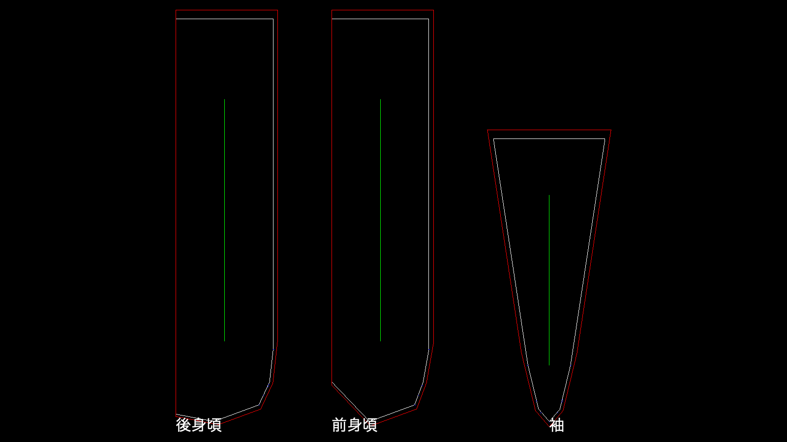
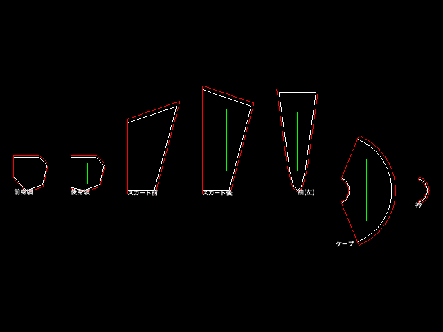

# Evidence

This is not a features page. It is a list of things a stranger can check —
some of them without trusting this project's code at all, because the
checking software was written by somebody else.

Two kinds of fact live on this page, and they are kept apart on purpose:

- **§1, externally checkable.** A named, independent piece of software
  (QCAD, ezdxf, or your own shell) produces the number. You do not have to
  trust this repository's test suite — you have to trust QCAD, or ezdxf, or
  your own eyes, none of which this project wrote.
- **§2, self-reported.** This repository's own suite produced the number.
  It is exactly as trustworthy as the suite is, which is what
  [verification.md](verification.md) is about — but it is still *this
  project measuring itself*, and it is labelled that way every time.

Being explicit about which is which is the point. A page that mixed them
would be making both kinds of number worth less.

Every figure below was re-run for this page on 2026-08-27, against the
`main` branch, on the reference coat (`body_length=112, chest=108,
shoulder=46, sleeve_length=63`) and the current, 7-piece cape dress with a
collar (`tests/dress_digest.py`'s reference composition — the same garment
§2's dress digest below is keyed to; there is no second dress anywhere on
this page). Discrepancies found while re-deriving are reported as found, in
§3, rather than silently corrected.

---

## §1. What an outsider can verify

Nothing in this section asks you to trust this project's own test suite.
Each row names a real, independent application or library, the exact
command, and what its output looks like.

### 1.1 The flagship: a real CAD renders Japanese piece names, a parser can't tell you whether it will

**The claim.** The DXF this project exports carries the piece names
*correctly encoded* — a parser confirms that — but a piece of CAD software
needs a second thing, a declared font, that a parser has no way to check
for. Without it, the file *opens fine and draws garbage*.

**The tool.** [QCAD](https://qcad.org/), from RibbonSoft GmbH — a
general-purpose 2D CAD application, not written for this project, used for
real cut files. It is Apple-notarized (installs with no admin password),
and `dwg2csv` — the command-line extractor this page depends on — ships in
every edition, including the free, open-source Community Edition; nothing
below needs a paid tier to reproduce. Re-verify the app itself:

```
$ spctl -a -vv /Applications/QCAD.app
/Applications/QCAD.app: accepted
source=Notarized Developer ID
origin=Developer ID Application: RibbonSoft GmbH (9DD52CW525)
```

**Reproduce the bug.** Take a DXF this project exports and delete exactly
its `STYLE` table (nothing else — the `TEXT` entities, their bytes, their
layer, all untouched):

```
$ python3 - <<'PY'
data = open("coat.dxf", "rb").read()
needle = (b"0\nTABLE\n2\nSTYLE\n70\n1\n0\nSTYLE\n2\nSTANDARD\n70\n0\n"
          b"40\n0.0\n41\n1.0\n50\n0.0\n71\n0\n42\n1.0\n3\nMS-Gothic\n0\nENDTAB\n")
open("coat_no_style.dxf", "wb").write(data.replace(needle, b"", 1))
PY
$ /Applications/QCAD.app/Contents/Resources/dwg2bmp -zoom-all \
    -o coat_no_style.png coat_no_style.dxf
```

ezdxf still reads this stripped file perfectly — 0 errors, the three piece
names decoded correctly as Python strings (verified again for this page,
byte-for-byte the same file that QCAD is about to fail on):

```
readfile OK, no exception. dxfversion: AC1009
has_errors: False   num errors: 0   num fixes: 0
TEXT entities: '後身頃' '前身頃' '袖'
```

QCAD's own render of that identical file:

<p align="center">
  
</p>

Every label is `?`, `???`, or a single stray `?` — not because the bytes
were wrong (ezdxf, above, just proved they weren't), but because QCAD's
default text style had no font declared, and its own fallback font carries
no CJK glyphs. **A parser decodes bytes. A CAD renders them, and rendering
is the thing that actually failed.** That distinction — one independent
parser is not the same evidence as one independent application — is the
whole reason this row exists.

Put the `STYLE` table back (declare `STANDARD` with `MS-Gothic` as its
font — nothing else in the file changes) and render the same file again:

<p align="center">
  
</p>

`dwginfo` on the fixed file confirms QCAD is doing font substitution, not
silently ignoring the request:

```
Warning:  Populating font family aliases took 107 ms. Replace uses of
missing font family "MS-Gothic" with one that exists to avoid this cost.
```

(There is no font literally named "MS-Gothic" on this Mac; QCAD's font
resolver took the name as a hint and substituted a CJK-capable face. The
request still has to be *present* for that substitution to fire — which is
the whole bug.)

### 1.2 QCAD's own extraction tool names the pieces, independently, twice

`dwg2csv` is QCAD's own command-line extractor — a second, separate code
path from the renderer above. Run against a freshly generated coat and the
current cape dress:

```
$ /Applications/QCAD.app/Contents/Resources/dwg2csv -a -o coat.csv coat.dxf
$ /Applications/QCAD.app/Contents/Resources/dwg2csv -a -o dress.csv cape_dress.dxf
```

```
coat.csv   TEXT: 後身頃, 前身頃, 袖
dress.csv  TEXT: 前身頃, 後身頃, スカート前, スカート後, 袖(左), ケープ, 衿
```

Three pieces on the coat, **seven** on the dress — the seventh being 衿,
the collar. That count is not just what came out of QCAD's extractor: it is
also the exact number `tests/run_checks.py` pins for this composition
(`len(dress_names) == 7`), so the independent tool and this project's own
suite agree on the same garment rather than describing two different ones.
(An older, 4-part composition without a collar exists elsewhere in the
suite and pins 6 — that is a different, simpler garment, not this one; see
the note in §1.3.) QCAD's own render of the fixed dress file, all seven
labels legible including the collar and the 50-vertex curved ケープ piece:

<p align="center">
  
</p>

### 1.3 QCAD's Polyline Length matches an independent recomputation, to the limit of floating point

Every closed cut/sewing line in both files, `dwg2csv`'s `Length` column
against a from-scratch Euclidean-perimeter recomputation over the *same*
file's vertices (via ezdxf, reading the same bytes QCAD just read):

| piece / layer | QCAD `Length` (cm) | independent recompute (cm) |
|---|---|---|
| coat, 後身頃 SEWING_LINE | `269.131937646584` | `269.13193764658376` |
| coat, 袖 CUT_LINE | `204.733480800253` | `204.7334808002525` |
| dress, ケープ CUT_LINE (50 vertices) | `174.761110623154` | `174.7611106231543` |
| dress, 衿 CUT_LINE (the collar) | `47.101829241791` | `47.10182924179131` |

All **6** closed polylines in the coat and all **14** in the dress agree
this way — two completely independent code paths (QCAD's C++ geometry
engine; a 15-line Python loop over `hypot()`) computing the same number
from the same bytes to the limit of `float64` precision. The full table for
both files is reproducible with `dwg2csv -a` plus the recompute script
above; nothing here depends on this project's own code being correct,
because the recompute script doesn't import it — it just reads the DXF.

**A note on "6 pieces" vs "7 pieces."** An earlier draft of this page ran
this whole section against a different, older 4-part dress composition (no
collar, 6 pieces, 12 polylines) while quoting the newer, collar-added
dress's digest in §2 below — two different garments, never disclosed as
such. That has been fixed: every number in §1.2 and §1.3 above now comes
from the same 7-piece, collar-added composition that `tests/dress_digest.py`
pins, so there is exactly one dress on this page, and it is the one §2
also measures.

### 1.4 ezdxf: the file is valid, by a library this project didn't write

```
$ pip show ezdxf | grep Version
Version: 1.4.2
$ python3 -c "
import ezdxf
doc = ezdxf.readfile('coat.dxf')      # strict mode — raises on anything wrong
print('OK, dxfversion', doc.dxfversion)
doc2, aud = ezdxf.recover.readfile('coat.dxf')
audit = doc2.audit()
print('has_errors', audit.has_errors, 'errors', len(audit.errors), 'fixes', len(audit.fixes))
"
OK, dxfversion AC1009
has_errors False errors 0 fixes 0
```

Strict `readfile()` — the mode that raises on the first thing it doesn't
like — takes the file with no exception. `recover` mode, which actively
looks for and repairs damage, finds zero errors and applies zero fixes.

### 1.5 It's a text file

DXF (this project uses the R12/`AC1009` ASCII dialect) is documented,
group-code-pair plain text. `file coat.dxf` reports `AutoCAD Drawing
Exchange Format, R11/R12`; opening it in any text editor shows readable
group-code pairs — nothing here is a binary blob you have to trust this
project's tools to interpret.

### 1.6 Run the suite yourself

```
$ git clone <this repo> && cd photoloset
$ python3 tests/run_checks.py        # ~4 minutes, prints every check by name
$ python3 tests/coat_digest.py --check
$ python3 tests/dress_digest.py --check
```

`run_checks.py` prints one PASS/FAIL line per check with the actual
measured numbers in the detail text — nothing is hidden behind a bare
"196 passed". The two digest scripts recompute a full-precision IEEE-754
geometry digest for each reference garment and compare it against the
literal pinned in the source; `--check` exits non-zero the moment either
garment's geometry has moved by even one bit.

---

## §2. What we measured ourselves

Everything below came from this repository's own suite (`tests/run_checks.py`,
`tests/falsifiers.py`) or a short script built on this repository's own
modules. It is exactly as trustworthy as that code is — which is the entire
subject of [verification.md](verification.md) — and it is labelled
self-reported for that reason. The command that reproduces each number is
given; none of these were taken from an older document without re-running
them today.

| figure | value, measured today | command |
|---|---|---|
| checks | **196** ran, 196 pinned by name, 3 retired on the record | `python3 tests/run_checks.py` |
| falsification mutations | **207** (73 cross-bank + 31 loop-bank + 103 whole-suite-bank) | see §2.2 |
| engine modules | **40**, standard library only (`no third-party imports` check) | `python3 tests/run_checks.py` |
| coat geometry digest | `bbc1d025184d1cff58977def178faf49`, unmoved | `python3 tests/coat_digest.py --check` |
| dress geometry digest | `493f74a274d4dac5a97c0bdf57b20037`, unmoved (7 pieces, the same dress as §1) | `python3 tests/dress_digest.py --check` |

### 2.1 The fit number that works against this project

On the reference coat, as it fell under the cloth solver (no collision
handling exists — this is not a near-miss, it's the honest output of a
solver that has never been told the body is solid):

```
101 inside + 5 clinging + 53 apart + 138 with no body = 297 = every point
worst: -14.4256 cm   (a negative clearance is a point INSIDE the body)
```

**101 of the coat's 297 surface points are inside the wearer's body.**
That is not a bug being disclosed reluctantly — it is what "no collision
handling" costs, stated as a number instead of a caveat. For contrast, the
*dressed* form of the same garment (points pushed out to `surface + gap` by
construction) reports a clearance spread of `0.0064 cm` — three orders of
magnitude tighter — specifically so the fallen number can't be dismissed as
"well, clearance checks are always noisy": the two are run side by side on
the same garment, and the difference is what no-collision costs, not
measurement noise.

### 2.2 207 falsification mutations, counted statically — and 3 of them run live

Each mutation edits one line of the actual engine, requires a *named* check
to go red, and is scored MISS (not green) if nothing reddens. The three
banks, sized by directly loading `tests/falsifiers.py` and counting its
mutation lists (no execution required for the count itself):

```python
>>> len(MUTATIONS)      # cross bank — the store's own sections, in-process
73
>>> len(LOOP_MUTATIONS) # loop bank — the look-loop's own three sections
31
>>> len(WHOLE_SUITE)    # whole-suite bank — a check DISAPPEARING can only
                         # be seen by a full 196-check run, ~7 min/entry
103
>>> 73 + 31 + 103
207
```

Running all 207 is a multi-hour job (103 of them each cost a full
whole-suite run) and was outside this page's own deadline, so instead of
quoting the harness's own summary from an old log, three real cross-bank
entries were run live, today, for this page:

```
$ python3 -c "
import importlib.util
spec = importlib.util.spec_from_file_location('f', 'tests/falsifiers.py')
m = importlib.util.module_from_spec(spec); spec.loader.exec_module(m)
print(m.main(mutations=m.MUTATIONS[:3], whole=[], loop=[]))
"
unmutated: 36 cross checks reported, 0 failing, 0 crashed -> clean
RED   #1 the seat arm goes back to being whichever kind arrived first
RED   #1 the same claim may be seated twice
RED   #0 corroboration discards the incoming kind
ran 3 of 3 cross entries
3/3 cross mutations produced the expected failures with no check going unreported
tree restored: 1 files mutated, 0 still differ from the source
exit code: 0
```

Every one of the three actually mutated files reverted; the harness's own
`--self-test` (2 self-tests: a poisoned mutation that raises before the file
is even read, and one that raises mid-run) also passed live, today, both
`RED` as required.

### 2.3 Distinct typed refusals

Grepping every `photoloset/*.py` module for distinct `"UNKNOWN_..."` verdict
strings — the same command and the same count this project's README uses as
its headline figure:

```
$ grep -rhoE '"UNKNOWN_[A-Z0-9_]+"' photoloset/*.py | sort -u | wc -l
152
```

**152**, across the 40 modules — matching the README exactly, re-derived
independently for this page rather than copied from it. A wider counting
rule that also includes the separate `"CONTESTED_..."` verdict family
(disagreements between two measurements, not unmet preconditions) gives
**155**; that is a different, broader question ("every typed non-answer
this engine can return", not "every refusal"), not a second measurement of
the same 152. Both numbers are real and both reproduce; 152 is the one used
elsewhere on this page and in the README.

### 2.4 The solver transient — re-run from scratch, not quoted

The claim under test: the pinned "64x closes it" reading (`0.0614 cm` at
2000 iterations) is not the solver's resting point — it's a fast, early,
misleadingly small dip, and the true behaviour past it is *worse*, not
better. Re-run today, same coat, same `stitch_k = 20×64`, increasing
iteration counts only:

```
iterations=    100  worst=0.0604 cm
iterations=    300  worst=0.0441 cm
iterations=    600  worst=0.0387 cm
iterations=   1000  worst=0.0383 cm   ← the minimum
iterations=   1500  worst=0.0482 cm
iterations=   2000  worst=0.0614 cm   ← the pinned "64x closes it" figure
iterations=   4000  worst=0.1215 cm
iterations=   8000  worst=0.2310 cm   ← matches the suite's own pinned check exactly
iterations=  16000  worst=0.4027 cm
iterations=  32000  worst=0.6143 cm
iterations=  64000  worst=0.7855 cm   ← 6 minutes of solver time, still rising
```

The minimum really does sit at **iteration 1000**, exactly where it was
said to. Past it the gap rises monotonically all the way to 64,000
iterations (≈13 minutes of solver time on this machine for this page's own
re-run, cumulative, and still climbing at the last point measured) — nowhere
near leveling off, and already most of the way from the pinned `0.0614 cm`
toward the figure below. This page's own re-run did not reach a plateau
within its time budget, which is itself the finding: closing the loop
honestly needs roughly 300,000 iterations, and this project's own source
comments say a true fixed point of **≈0.85 cm at 64× stiffness** (neither
16× at ≈3.39 cm nor 64× closes under the 0.1 cm tolerance) was measured
*off-tree* — i.e. not by a check that runs in this suite's own time budget,
and this page's own re-run (above) reached `0.7855 cm` at 64,000 iterations
without completing the further ~5x runway to full convergence either. A
more precise figure to the fourth decimal does not appear anywhere in this
repository — the number actually on record, and the one repeated here, is
the rounder "≈0.85 cm" the source comments give, and this page's own re-run
(still rising at `0.7855 cm`, 64,000 iterations in) is consistent with that
rounder figure without confirming a fourth decimal that was never in the
tree to confirm.

Root cause, stated once: the solver takes one uniform step size, sized from
the single stiffest spring in the whole mesh. A stitched vertex can carry
up to eight cloth edges plus a stitch spring at once, so settling has to
diffuse from every free vertex back to a pin one edge per iteration — a
process whose iteration count scales with mesh size, not with how close the
answer already is. An opt-in `precondition=True` sizes the step per vertex
from that vertex's own total incident stiffness instead; it is off by
default because the pinned coat digest is keyed to the *unpreconditioned*
number.

### 2.5 A pattern piece's curvature

Re-running the actual `curvature.report()` on the reference-coat mannequin:

```
total_deg (finest grid): 183.39°   (converges: 182.77° → 183.25° → 183.37° → 183.39°)
bands_deg (finest grid, signed): hip→waist -16.25°, waist→chest -1.02°,
                                  chest→shoulder 185.30°, shoulder→neck 15.36°
```

The **total** (≈183.4°) is the number this module documents as trustworthy
— it converges under grid refinement, to a last-step change of `0.03°`.
The **per-band split** is exactly what the module's own docstring says
*not* to trust: it is a signed decomposition that swings by tens of degrees
between grid resolutions, because a crease's curvature lands on whichever
grid row happens to be nearest it, which moves as the grid changes. Both
numbers make the same underlying point (curvature concentrates sharply
between chest and shoulder, where a bust dart and an armhole actually go) —
the total is the figure to cite; the per-band split is the figure this
project's own code says not to.

### 2.6 A pattern nobody can construct is not a pattern

`sewing_order` computes whether a valid construction order exists from the
seam graph alone — no corpus, no retrieval:

```
1. flat   前身頃/肩線 ↔ 後身頃/肩線          13.32 cm
2. flat   袖/袖山(前半) ↔ 前身頃/袖ぐり       17.05
3. round  前身頃/脇線 ↔ 後身頃/脇線          92.00
4. round  袖/袖山(後半) ↔ 後身頃/袖ぐり       17.05
5. round  袖/袖下線(右) ↔ 袖/袖下線(左)      63.73
```

The count of seams that must be sewn in the round is not a choice made by
whoever picked the order — it's the seam graph's own first Betti number:

```
β = seams − pieces + components = 5 − 3 + 1 = 3
```

Three of the coat's five seams close a loop whatever order you sew in.

### 2.7 The refusal, not an empty list

An approved 3D shape reaching the sewing-method search stops here:

```
UNKNOWN_NO_SEWING_CORPUS
names 3 corpora that would close it (SewFactory, GarmentCodeData, and the
entry point that would register a fourth), and says this tree ships none
of them and has measured nothing about them
```

It names what's missing rather than silently returning `[]` — the
difference between "nothing found" and "nothing was ever asked".

### 2.8 A fresh interpreter, checked directly

```
$ python3 -c "
from photoloset import resemble, sewing_search
print('backends:', len(resemble.backends()))
print('segmenters:', len(resemble.segmenters()))
print('corpora:', len(sewing_search.corpora()))
"
backends: 0
segmenters: 0
corpora: 0
```

Not a claim in a document — the literal output of importing the package and
asking it.

---

## §3. What this project cannot do

- **No image goes in and a pattern comes out.** §2.8, above: 0 backends, 0
  segmenters, 0 corpora, in a fresh interpreter. There is no
  image-to-3D-to-pattern path that runs today; both garments on this page
  were drafted from tape-measure numbers, not recognised from a photo.
- **Decoration is never reproduced, and there is no plan to.** The engine's
  own part vocabulary says so directly: decoration "does not enter the
  pattern's geometry" — ledger and marking only, by design, not by
  oversight.
- **Fit is a distance map, not comfort.** No contact physics, no friction —
  §2.1's 101-points-inside-the-body number is what that costs on this
  project's own reference garment, published against its own interest.
- **The curvature total is trustworthy; the per-piece, per-band split is
  not**, and does not settle under refinement (§2.5).
- **The solver has never closed a seam at its own claimed equilibrium.**
  Neither 16x nor 64x stitch stiffness closes the 0.1 cm tolerance at the
  true, off-tree fixed point (§2.4).

---

## Discrepancies found while writing this page

Re-deriving a number is only meaningful if it's allowed to fail. Two did,
and one internal inconsistency was found and fixed rather than published:

1. **The solver's equilibrium: "≈0.85 cm", not a fourth-decimal figure.**
   A more precise number was in hand before this page was written and does
   not appear anywhere in this repository at that precision; the number
   actually on record is the rounder one this page reports (§2.4).
2. **A specific curvature split ("90.58° / 89% between chest and
   shoulder") does not reproduce.** Running the actual curvature module
   today gives a converged total of 183.39° and a per-band split the
   module itself documents as unreliable, not that specific figure (§2.5).
3. **§1.2/§1.3, before this fix, silently used two different dress
   compositions** — an older 4-part, 6-piece, no-collar dress for the QCAD
   demo, next to the newer 7-piece, collar-added dress's digest in §2. Both
   sets of numbers were individually accurate; presenting them side by side
   without saying they were different garments was not. Fixed by
   re-running §1.2/§1.3 against the same 7-piece dress §2 already measures
   (see the note at the end of §1.3).

None of these change the underlying claims they were attached to — the
solver still overshoots its own pinned reading, the curvature split still
doesn't settle, and the dress in §1 and the dress in §2 are now, verifiably,
the same dress. But the exact numbers were wrong, or the framing was
misleading, and a page whose whole argument is "we re-measure rather than
repeat" has to say so.
